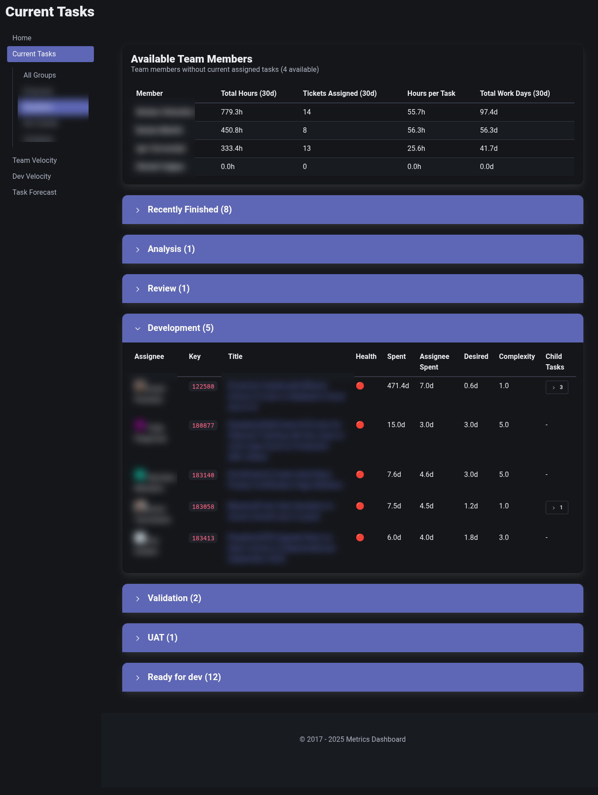
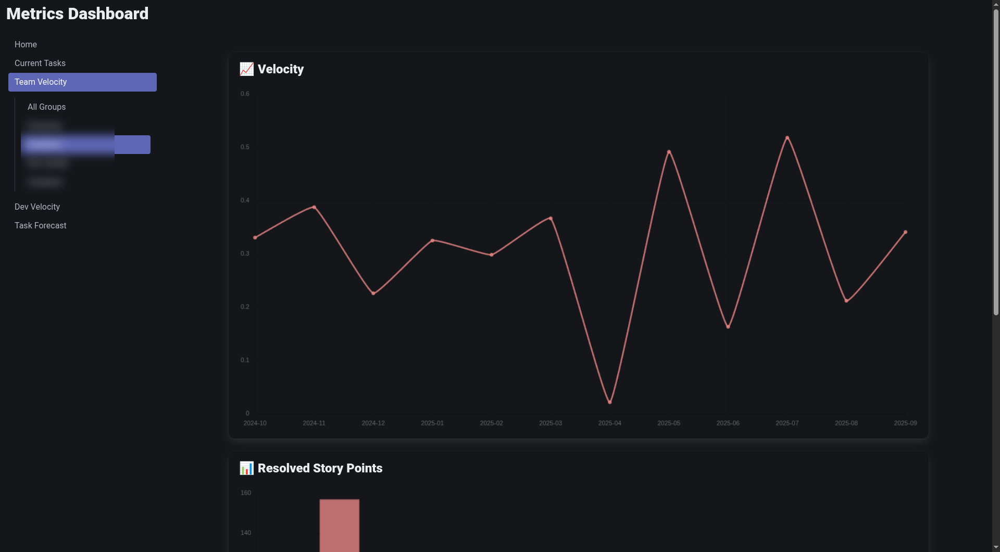
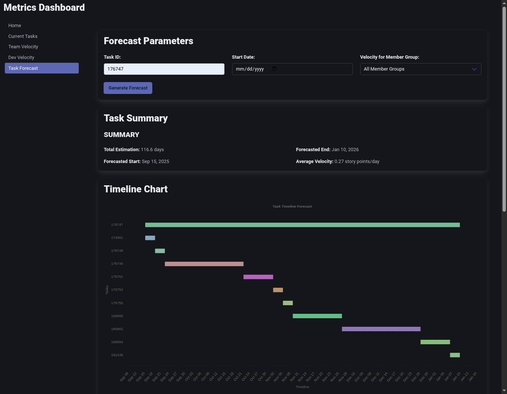

# Metrics Dashboard

A Django-based team velocity and task tracking dashboard that connects to JIRA and Azure DevOps to provide insights into your development process.


## What It Does

Transform your JIRA or Azure DevOps data into actionable development insights:

- **📋 Current Tasks**: Real-time view of active work with completion forecasts
- **🚀 Team Velocity**: Track story points and delivery trends over time
- **👨‍💻 Developer Velocity**: Individual velocity metrics
- **🔮 Task Forecasting**: Predict completion dates based on team velocity

<details>
<summary>📸 View Screenshots</summary>

### Current Tasks Dashboard


### Team Velocity Tracking


### Task Forecasting


</details>


## Quick Start

Choose your preferred setup method:

### Option 1: Docker (Recommended for Non-Python Users)

#### 1. Clone Repository
```bash
git clone <repository-url>
cd metrics
```

#### 2. Configure Environment
Copy the example environment file:
```bash
cp .env.example .env
```

Edit `.env` with your configuration (see [Configuration Guide](#configuration-guide) below).

#### 3. Build and Run with Docker

**Quick Start with JIRA (Single Command):**
```bash
# Build the image
docker build -f ops/docker/Dockerfile -t metrics-dashboard .

# Run with minimal JIRA configuration (replace with your values)
docker run -p 8000:8000 \
  -e METRICS_TASK_TRACKER=jira \
  -e METRICS_JIRA_SERVER_URL=https://your-company.atlassian.net \
  -e METRICS_JIRA_EMAIL=your-email@company.com \
  -e METRICS_JIRA_API_TOKEN=your-api-token \
  -e 'METRICS_PROJECT_KEYS=["PROJ"]' \
  metrics-dashboard
```

**Quick Start with Azure DevOps:**
```bash
# Build the image
docker build -f ops/docker/Dockerfile -t metrics-dashboard .

# Run with minimal Azure configuration (replace with your values)
docker run -p 8000:8000 \
  -e METRICS_TASK_TRACKER=azure \
  -e METRICS_AZURE_ORGANIZATION_URL=https://dev.azure.com/your-org \
  -e METRICS_AZURE_PAT=your-personal-access-token \
  -e METRICS_AZURE_PROJECT=YourProject \
  metrics-dashboard
```

**Using Environment File (Recommended for Multiple Variables):**
```bash
# Run the container with environment variables from file
docker run -p 8000:8000 --env-file .env metrics-dashboard
```

#### 4. Access Dashboard
Visit http://localhost:8000 in your browser.

### Option 2: Python Development Setup

#### 1. Clone and Setup
```bash
git clone <repository-url>
cd metrics
source ~/.virtualenvs/metrics/bin/activate  # or your venv
pip install -r requirements.txt
```

#### 2. Configure Your Task Tracker

Copy the example environment file:
```bash
cp .env.example .env
```

**For JIRA:**
```bash
# Edit .env file
METRICS_TASK_TRACKER=jira
METRICS_JIRA_SERVER_URL=https://your-company.atlassian.net
METRICS_JIRA_EMAIL=your-email@company.com
METRICS_JIRA_API_TOKEN=your-api-token
METRICS_PROJECT_KEYS=["PROJ", "TEAM"]
METRICS_STORY_POINT_CUSTOM_FIELD_ID=customfield_10016
```

**For Azure DevOps:**
```bash
# Edit .env file
METRICS_TASK_TRACKER=azure
METRICS_AZURE_ORGANIZATION_URL=https://dev.azure.com/your-org
METRICS_AZURE_PAT=your-personal-access-token
METRICS_AZURE_PROJECT=YourProject
```

### 3. Configure Your Team
```bash
# Add to .env file
METRICS_MEMBERS={"John Doe": {"level": "senior", "member_groups": ["Team A"], "stages": ["Development"]}, "Jane Smith": {"level": "middle", "member_groups": ["Team B"], "stages": ["Testing"]}}
```

#### 3. Run the Application
```bash
python manage.py migrate
python manage.py check  # Verify configuration
python manage.py runserver 8000
```

#### 4. Access Dashboard
Visit http://localhost:8000 in your browser.

## Configuration Guide

### Basic Team Configuration

Configure team members with skill levels for accurate velocity calculations:

```bash
METRICS_MEMBERS={
  "John Doe": {
    "level": "senior", 
    "member_groups": ["Team A"], 
    "stages": ["Development"]
  }, 
  "Jane Smith": {
    "level": "middle", 
    "member_groups": ["Team B"], 
    "stages": ["Testing"]
  }
}
```

**Skill Levels**: `junior`, `middle`, `senior`

### Status Code Customization

Match your team's workflow by customizing status mappings:

```bash
METRICS_IN_PROGRESS_STATUS_CODES=["Analysis", "Active", "In Progress", "In Development", "QA", "Validation", "Testing", "Review"]
METRICS_PENDING_STATUS_CODES=["Blocked", "On Hold", "Pending", "Waiting"]
METRICS_DONE_STATUS_CODES=["Done", "Closed", "Resolved"]
```

### Advanced Configuration

#### Performance & Calculation Settings
```bash
METRICS_WORKING_DAYS_PER_MONTH=22
METRICS_IDEAL_HOURS_PER_DAY=4.0
METRICS_STORY_POINTS_TO_IDEAL_HOURS_CONVERTION_RATIO=1.0
METRICS_RECENTLY_FINISHED_TASKS_DAYS=14
```

#### Seniority Level Multipliers
Adjust velocity multipliers based on experience levels:
```bash
METRICS_SENIORITY_LEVELS={"senior": 1.0, "middle": 2.0, "junior": 4.0}
```

#### Filtering Options
Filter data by task types, teams, or epics:
```bash
METRICS_GLOBAL_TASK_TYPES_FILTER=["Story", "Bug", "Task"]
METRICS_GLOBAL_TEAM_FILTER=["Team A", "Team B"]
```

#### Custom Member Group Filters
Override default assignee-based filtering with custom queries per member group:
```bash
# JIRA example - filter by parent epic
METRICS_MEMBER_GROUP_CUSTOM_FILTERS='{"TeamA": "parent in (PROJ-123, PROJ-456, PROJ-789)"}'

# Azure DevOps example - filter by parent work items
METRICS_MEMBER_GROUP_CUSTOM_FILTERS='{"TeamB": "[System.Parent] IN (174641, 176747, 179803)"}'
```

#### Task Sorting Configuration
Customize how tasks are sorted within each workflow stage:
```bash
# Default sorting criteria (applied to all stages unless overridden)
# Supported criteria: priority, assignee, health, spent_time
# Use '-' prefix for descending order (e.g., "-health" for worst health first)
METRICS_DEFAULT_SORT_CRITERIA=-health,-spent_time

# Stage-specific sorting (overrides default for specific stages)
# Example: Sort "Ready for Dev" stage by priority first, then assignee
METRICS_STAGE_SORT_OVERRIDES='{"Ready for Dev": "priority,assignee,-health"}'
```

**Available sort criteria:**
- `priority` - Task priority (ascending: 1, 2, 3...)
- `assignee` - Assignee name (alphabetical)
- `health` - Health status (ascending: GREEN → YELLOW → RED)
- `spent_time` - Time already spent on task

**Sort direction:**
- No prefix = ascending (e.g., `priority` for 1, 2, 3)
- `-` prefix = descending (e.g., `-health` for RED, YELLOW, GREEN)

#### Default Values
Configure fallback values when data is missing:
```bash
METRICS_DEFAULT_STORY_POINTS_VALUE_WHEN_MISSING=3
METRICS_DEFAULT_SENIORITY_LEVEL_WHEN_MISSING=middle
METRICS_DEFAULT_HEALTH_STATUS_WHEN_MISSING=GREEN
METRICS_MEMBER_GROUP_WHEN_MISSING="Unassigned"
```

## Troubleshooting

### Common Issues

#### Configuration Problems

**Error: JIRA connection failed**
- Verify `METRICS_JIRA_SERVER_URL` is correct (include https://)
- Check `METRICS_JIRA_EMAIL` matches your JIRA account
- Ensure `METRICS_JIRA_API_TOKEN` is valid and has proper permissions
- Test connection: `python manage.py check`

**Error: Story points not showing**
- Find your custom field ID in JIRA → Settings → Issues → Custom Fields → Story Points → View (ID in URL)
- Update `METRICS_STORY_POINT_CUSTOM_FIELD_ID=customfield_XXXXX`

**Error: Azure DevOps connection issues**
- Ensure your PAT has "Work Items (Read)" permissions
- Verify `METRICS_AZURE_ORGANIZATION_URL` format: `https://dev.azure.com/your-org`
- Check `METRICS_AZURE_PROJECT` matches exact project name (case-sensitive)

#### Data Issues

**No tasks appearing**
- Check `METRICS_PROJECT_KEYS` includes your project(s)
- Verify `METRICS_GLOBAL_TASK_TYPES_FILTER` includes relevant task types
- Review status code mappings match your workflow

**Velocity calculations seem wrong**
- Verify team member levels in `METRICS_MEMBERS`
- Check seniority multipliers in `METRICS_SENIORITY_LEVELS`
- Ensure `METRICS_STORY_POINTS_TO_IDEAL_HOURS_CONVERTION_RATIO` fits your team

**Team members not showing up**
- Add members to `METRICS_MEMBERS` with proper levels and groups
- Check member names match exactly (case-sensitive)
- Verify `METRICS_MEMBER_GROUP_WHEN_MISSING` is configured

#### Performance Issues

**Dashboard loading slowly**
- Reduce `METRICS_RECENTLY_FINISHED_TASKS_DAYS` for faster queries
- Consider using `METRICS_GLOBAL_TEAM_FILTER` to limit data scope
- Check your task tracker API rate limits

**Memory issues**
- Increase server memory allocation
- Review `METRICS_GLOBAL_TASK_TYPES_FILTER` to exclude unnecessary task types

### Configuration Validation

After making changes, verify everything works:
```bash
python manage.py check
```

If issues persist, check Django logs for detailed error messages.

### Getting Help

- Review configuration examples in `.env.example`
- Check the [Architecture Overview](#architecture-overview) for technical details
- Verify all required environment variables are set

## Production Deployment

### Security Configuration

#### HTTP Basic Authentication
Protect your dashboard with username/password authentication:
```bash
METRICS_BASIC_AUTH_USERS='{"admin": "your-secure-password", "viewer": "another-password"}'
```

If not set, the dashboard will be publicly accessible.

#### Environment Security
- Set `DEBUG=False` in production
- Configure `ALLOWED_HOSTS` with your domain: `ALLOWED_HOSTS=your-domain.com,www.your-domain.com`
- Use strong, unique passwords for `METRICS_BASIC_AUTH_USERS`
- Store API tokens securely and rotate them regularly

### Production Setup

1. **Build Static Assets**
   ```bash
   python manage.py compress
   ```

2. **Run with Production Server**
   ```bash
   gunicorn metrics.wsgi:application
   ```

3. **Database Setup**
   ```bash
   python manage.py migrate
   ```

4. **Health Check**
   ```bash
   python manage.py check --deploy
   ```

### Performance Optimization

- **Configure Caching**: The app uses Django's cache framework for task search results
- **Monitor Memory Usage**: Large datasets may require additional memory
- **API Rate Limits**: Be aware of JIRA/Azure DevOps API rate limits
- **Static File Serving**: Use a reverse proxy (nginx) for static files in production

### Environment Variables for Production

Essential production settings:
```bash
DEBUG=False
ALLOWED_HOSTS=your-domain.com,www.your-domain.com
METRICS_BASE_URL=https://your-domain.com
METRICS_BASIC_AUTH_USERS='{"admin": "secure-password"}'
```

## Architecture Overview

The application follows a **Modular Monolith** pattern with **Hexagonal Architecture** principles, providing deployment simplicity while maintaining clean architectural boundaries.

### Modular Monolith Structure

```
metrics/
├── tasks/          # Task management and tracking
├── velocity/       # Developer and team velocity calculations  
├── forecast/       # Task completion forecasting
├── ui_web/         # Web interface and data federation
└── metrics/        # Django project configuration
```

**Core Principles:**
- **Module Independence**: Each module is self-contained with its own domain logic
- **API-Only Communication**: Modules communicate exclusively through public APIs in `app/api/`
- **Hexagonal Architecture**: Clean separation between domain logic and external concerns
- **Federation Gateway**: UI module orchestrates data from other modules

### Module Communication Pattern

Modules communicate through the **API Repository Pattern**, ensuring loose coupling:

```python
# forecast/out/tasks_api_repository.py
class TasksApiRepository(TaskRepository):
    def __init__(self, task_search_api):
        self._task_search_api = task_search_api
    
    async def search(self, criteria) -> List[Task]:
        return await self._task_search_api.search(criteria)
```

### Dependency Injection

The application uses a simple, manual dependency injection (DI) pattern. Each module defines a `Container` class (e.g., `TasksContainer`) that is responsible for instantiating and wiring together the services within that module. A singleton instance of the container is created and imported by other modules to consume its public APIs, which are exposed as properties on the container.

This approach avoids complex DI frameworks and makes the dependency graph explicit and easy to trace.

### Data Flow Architecture

The **FederatedDataFetcher** orchestrates concurrent data collection for `views`:

```python
tasks = await (
    FederatedDataFetcher
    .for_(lambda: self._get_all_tasks())
    .with_foreach_populator(self.forecast_api.populate_estimations)
    .with_result_post_processor(self._sort_tasks_by_health_status)
    .fetch()
)
```

### Frontend Architecture

The UI is a dynamic, server-rendered application that leverages modern libraries to create a responsive and interactive experience without a complex JavaScript toolchain:

- **Bulma**: A lightweight, modern CSS framework used for all styling.
- **HTMX**: The core of the UI's interactivity. HTMX is used to perform AJAX requests and update parts of a page directly from HTML, enabling a dynamic, single-page application feel.
- **Chart.js**: Powers all data visualizations, rendering the charts and graphs for velocity and forecasting.

### Core Implementation Classes

#### Module Structure Pattern
Each module follows identical structure:
```
{module_name}/
├── app/
│   ├── api/                    # Public interfaces (ApiFor{Domain})
│   ├── domain/                 # Business logic
│   │   ├── model/             # Domain models and config
│   │   └── {domain}_service.py # Core business services
│   └── spi/                   # External dependencies
├── out/                       # External integrations
├── config_loader.py           # Module configuration
└── container.py              # DI container and module interface
```

#### Key Classes by Module

**Tasks Module**
- `TaskService`: Core task operations and business logic
- `ApiForTaskSearch`: Public interface for task queries
- `JiraTaskRepository` / `AzureTaskRepository`: External data access
- `TasksConfig`: Module configuration and settings

**Velocity Module**  
- `VelocityService`: Orchestrates velocity calculations
- `ApiForVelocityCalculation`: Public interface for velocity metrics
- `UserVelocityCalculator`: Individual developer metrics (from sd-metrics-lib)
- `GeneralizedTeamVelocityCalculator`: Team-wide metrics (from sd-metrics-lib)

**Forecast Module**
- `ForecastService`: Business logic for forecasting algorithms  
- `ApiForForecast`: Public interface for completion predictions
- `TaskEstimationCalculator`: Completion time predictions
- `CapacityPlanningService`: Resource allocation recommendations

**UI Web Module**
- `FederatedDataFetcher`: Core data orchestration across modules
- Component-based facades: `TeamVelocityFacade`, `TaskHealthFacade`
- Data classes: `ChartData`, `MemberGroupData`, `TaskHealthData`
- Convertors: Transform domain objects to UI-specific data structures

### Domain-Driven Design

Domain models use nested objects reflecting business concepts:

```python
@dataclass(slots=True)
class Task:
    id: str
    title: str
    assignment: Assignment
    time_tracking: TimeTracking
    system_metadata: SystemMetadata

@dataclass(slots=True)
class Assignment:
    assignee: Optional[User] = None
    team: Optional[Team] = None
```

### Integration with sd-metrics-lib

The application leverages **sd-metrics-lib** using the **Calculators + Sources** architecture:

1. Configure `TaskProvider` (JIRA/Azure via `JiraTaskProvider`, `AzureTaskProvider`)
2. Configure extractors (`StoryPointExtractor`, `WorklogExtractor`) 
3. Provide to calculators (`UserVelocityCalculator`, `GeneralizedTeamVelocityCalculator`)

This ensures battle-tested metric calculations while maintaining clean architectural boundaries.

## Requirements

- Python 3.9+
- JIRA or Azure DevOps access with API permissions
- Virtual environment (recommended)

## Contributing

1. Fork the repository
2. Create a feature branch (`git checkout -b feature/amazing-feature`)
3. Commit your changes (`git commit -m 'Add amazing feature'`)
4. Push to the branch (`git push origin feature/amazing-feature`)
5. Open a Pull Request

---

Built with Django 5.2, sd-metrics-lib 7.0, and modern web standards for sustainable software development metrics.