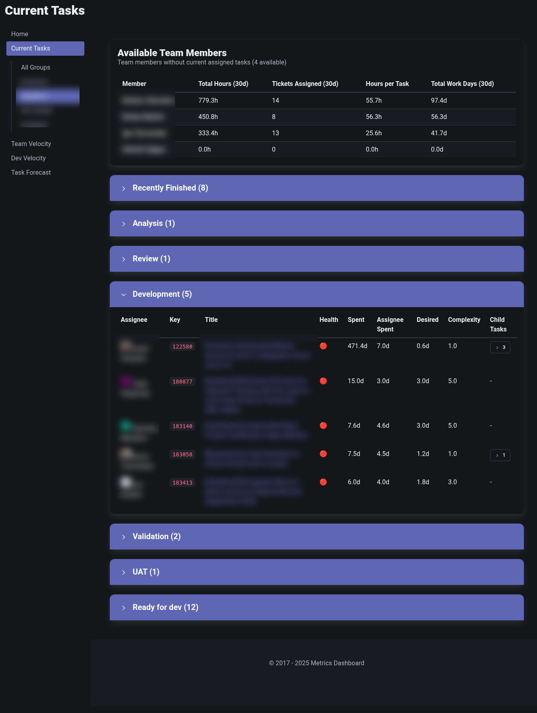
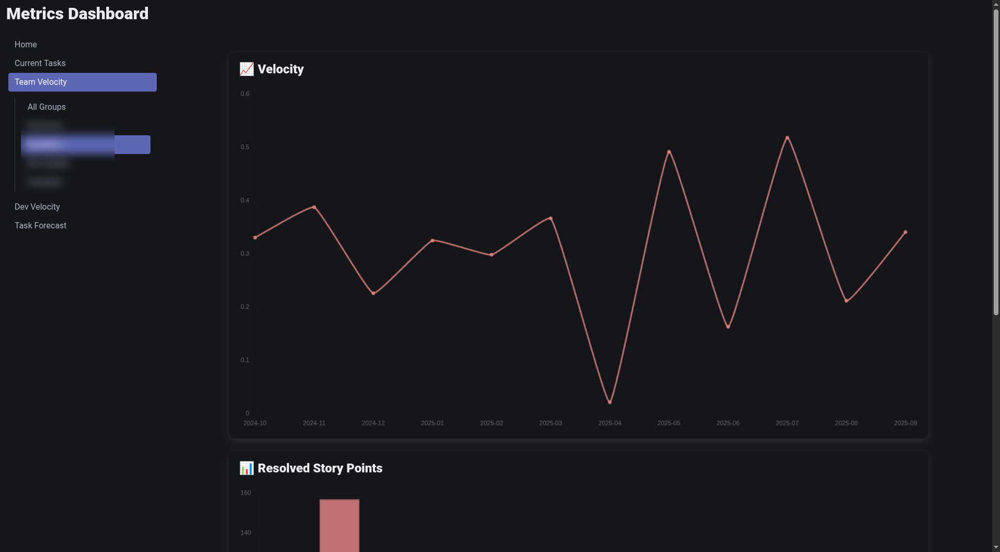
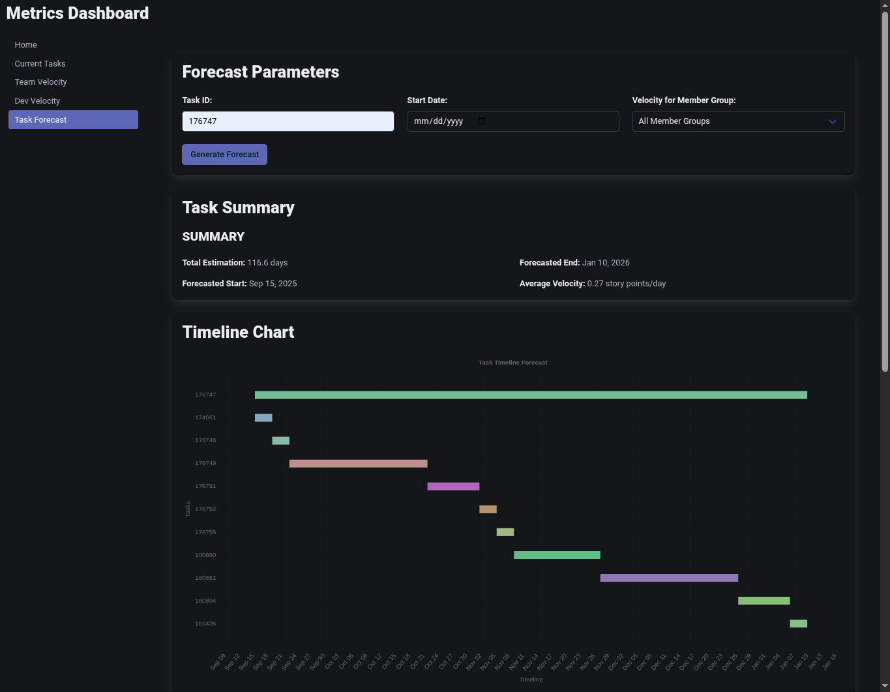

# Metrics Dashboard

A Django-based team velocity and task tracking dashboard that connects to JIRA and Azure DevOps to provide insights into your development process.


## What It Does

Transform your JIRA or Azure DevOps data into actionable development insights:

- **📋 Current Tasks**: Real-time view of active work with completion forecasts and configurable per-field filters (priority, release, assignee, health, …)
- **🚀 Team Velocity**: Track story points and delivery trends over time with rolling averages
- **👨‍💻 Developer Velocity**: Individual velocity metrics with seniority-level thresholds, rolling averages, and unfinished task inclusion
- **🔮 Task Forecasting**: Predict completion dates based on team velocity, with completed vs remaining work breakdown
- **🔀 Pull Requests**: Open PRs with per-reviewer approvals (split into Main vs Additional reviewers and labelled by vote state), Internal & Required review gates, linked tickets sorted by priority, and a per-person activity rollup

<details>
<summary>📸 View Screenshots</summary>

### Current Tasks Dashboard


### Team Velocity Tracking


### Task Forecasting


</details>


## Quick Start

Choose your preferred setup method:

### Option 1: Docker (Recommended for Non-Python Users)

#### 1. Clone Repository
```bash
git clone <repository-url>
cd metrics
```

#### 2. Configure Environment
Copy the example environment file:
```bash
cp .env.example .env
```

Edit `.env` with your configuration (see [Configuration Guide](#configuration-guide) below).

#### 3. Build and Run with Docker

**Quick Start with JIRA (Single Command):**
```bash
# Build the image
docker build -f ops/docker/Dockerfile -t metrics-dashboard .

# Run with minimal JIRA configuration (replace with your values)
docker run -p 8000:8000 \
  -e METRICS_TASK_TRACKER=jira \
  -e METRICS_JIRA_SERVER_URL=https://your-company.atlassian.net \
  -e METRICS_JIRA_EMAIL=your-email@company.com \
  -e METRICS_JIRA_API_TOKEN=your-api-token \
  -e 'METRICS_PROJECT_KEYS=["PROJ"]' \
  metrics-dashboard
```

**Quick Start with Azure DevOps:**
```bash
# Build the image
docker build -f ops/docker/Dockerfile -t metrics-dashboard .

# Run with minimal Azure configuration (replace with your values)
docker run -p 8000:8000 \
  -e METRICS_TASK_TRACKER=azure \
  -e METRICS_AZURE_ORGANIZATION_URL=https://dev.azure.com/your-org \
  -e METRICS_AZURE_PAT=your-personal-access-token \
  -e METRICS_AZURE_PROJECT=YourProject \
  metrics-dashboard
```

**Using Environment File (Recommended for Multiple Variables):**
```bash
# Run the container with environment variables from file
docker run -p 8000:8000 --env-file .env metrics-dashboard
```

#### 4. Access Dashboard
Visit http://localhost:8000 in your browser.

### Option 2: Python Development Setup

#### 1. Clone and Setup
```bash
git clone <repository-url>
cd metrics
source ~/.virtualenvs/metrics/bin/activate  # or your venv
pip install -r requirements.txt
```

#### 2. Configure Your Task Tracker

Copy the example environment file:
```bash
cp .env.example .env
```

**For JIRA:**
```bash
# Edit .env file
METRICS_TASK_TRACKER=jira
METRICS_JIRA_SERVER_URL=https://your-company.atlassian.net
METRICS_JIRA_EMAIL=your-email@company.com
METRICS_JIRA_API_TOKEN=your-api-token
METRICS_PROJECT_KEYS=["PROJ", "TEAM"]
METRICS_STORY_POINT_CUSTOM_FIELD_ID=customfield_10016
```

**For Azure DevOps:**
```bash
# Edit .env file
METRICS_TASK_TRACKER=azure
METRICS_AZURE_ORGANIZATION_URL=https://dev.azure.com/your-org
METRICS_AZURE_PAT=your-personal-access-token
METRICS_AZURE_PROJECT=YourProject
```

### 3. Configure Your Team
```bash
# Add to .env file
METRICS_MEMBERS={"John Doe": {"level": "senior", "member_groups": ["Team A"], "stages": ["Development"]}, "Jane Smith": {"level": "middle", "member_groups": ["Team B"], "stages": ["Testing"]}}
```

#### 3. Run the Application
```bash
python manage.py migrate
python manage.py check  # Verify configuration
python manage.py runserver 8000
```

#### 4. Access Dashboard
Visit http://localhost:8000 in your browser.

## Configuration Guide

### Basic Team Configuration

Configure team members with skill levels for accurate velocity calculations:

```bash
METRICS_MEMBERS={
  "John Doe": {
    "level": "senior", 
    "member_groups": ["Team A"], 
    "stages": ["Development"]
  }, 
  "Jane Smith": {
    "level": "middle", 
    "member_groups": ["Team B"], 
    "stages": ["Testing"]
  }
}
```

**Skill Levels**: `junior`, `middle`, `senior` — drive the velocity multipliers (see [Seniority Level Multipliers](#seniority-level-multipliers)) and the PR Main/Additional reviewer split.

**Stages** (optional): the workflow stages a member works in, using your `METRICS_STAGES` keys (e.g. `Development`, `Validation`). Used to scope the Current Tasks "Available Members" table — see [Current Tasks Page](#current-tasks-page).

### Status Code Customization

Match your team's workflow by customizing status mappings:

```bash
METRICS_IN_PROGRESS_STATUS_CODES=["Analysis", "Active", "In Progress", "In Development", "QA", "Validation", "Testing", "Review"]
METRICS_PENDING_STATUS_CODES=["Blocked", "On Hold", "Pending", "Waiting"]
METRICS_DONE_STATUS_CODES=["Done", "Closed", "Resolved"]
```

### Advanced Configuration

#### Performance & Calculation Settings
```bash
METRICS_WORKING_DAYS_PER_MONTH=22
METRICS_IDEAL_HOURS_PER_DAY=4.0
METRICS_STORY_POINTS_TO_IDEAL_HOURS_CONVERTION_RATIO=1.0
METRICS_RECENTLY_FINISHED_TASKS_DAYS=14
```

#### Seniority Level Multipliers
Adjust velocity multipliers based on experience levels:
```bash
METRICS_SENIORITY_LEVELS={"senior": 1.0, "middle": 2.0, "junior": 4.0}
```

#### Filtering Options
Filter data by task types, teams, or epics:
```bash
METRICS_GLOBAL_TASK_TYPES_FILTER=["Story", "Bug", "Task"]
METRICS_GLOBAL_TEAM_FILTER=["Team A", "Team B"]
```

#### Custom Member Group Filters
Override default assignee-based filtering with custom queries per member group:
```bash
# JIRA example - filter by parent epic
METRICS_MEMBER_GROUP_CUSTOM_FILTERS='{"TeamA": "parent in (PROJ-123, PROJ-456, PROJ-789)"}'

# Azure DevOps example - filter by parent work items
METRICS_MEMBER_GROUP_CUSTOM_FILTERS='{"TeamB": "[System.Parent] IN (174641, 176747, 179803)"}'
```

#### Merge Unassigned Tasks Into Filtered Group
When filtering by a specific member group, unassigned tasks normally appear under a separate "Unassigned" header. Enable this to relabel them under the filtered group's header instead:
```bash
METRICS_MERGE_UNASSIGNED_INTO_FILTERED_GROUP=true
```
This only applies when viewing a specific member group — the "All Groups" view is unaffected.

#### Current Tasks Page
The Current Tasks page (`/current-tasks/`) loads lazily by default: it paints the structure (member groups → stages → counts) immediately, then fetches each stage's rows (health + spent time) only when you expand that stage, and loads the "Available Members" table in the background. This keeps cold loads fast by deferring the expensive per-task history fetches to the stages you actually open.

```bash
# Restrict the "Available Members" table to people working in these stages
# (matched against each member's "stages"). Empty (default) shows all unassigned members.
# Useful to hide non-developers like managers (who sit in Analysis/UAT) from capacity tracking.
METRICS_AVAILABLE_MEMBER_STAGES_FILTER=["Development", "Validation"]

# Set to false to disable lazy loading and restore the previous eager behavior:
# one full fetch up front, stages rendered expanded, members table rendered synchronously.
METRICS_CURRENT_TASKS_LAZY_LOADING=true
```

#### Filtering on Current Tasks
The Current Tasks board shows a row of filter dropdowns — pick values across several and click **Apply** to narrow the board in a single request. Choose which fields are filterable (and the order they appear) with `METRICS_TASK_FILTER_FIELDS`:
```bash
# Ordered list of filter dropdowns on the Current Tasks page.
# Supported: priority, release, assignee, member_group, parent, stage, status, story_points, health
# Default (omit the variable to use this):
METRICS_TASK_FILTER_FIELDS=["health", "priority", "release", "assignee", "parent"]
```
Each dropdown lists the distinct values present for the current member group; filtering runs server-side and combines with AND. Filtering by **health** loads full task data for that one request (health needs the per-task history that lazy loading otherwise defers), so it costs the same as expanding every stage.

#### Release Column on Current Tasks
The Current Tasks table can show a "Release" column populated from a per-backend field. Set the field name for whichever tracker you use; set to empty to hide the column.
```bash
# JIRA: defaults to fixVersions; override to a custom field id if needed
METRICS_JIRA_RELEASE_FIELD=fixVersions

# Azure: defaults to System.IterationPath (renders the iteration leaf, e.g. "Sprint 12").
# Point to a custom field like Custom.Release for plain version strings (e.g. "2026.015").
METRICS_AZURE_RELEASE_FIELD=Custom.Release
```
Multi-value fields (e.g. JIRA `fixVersions` with two versions) and comma-separated string values (e.g. `"2026.015, 2026.016"` in a custom field) are split per release with whitespace trimmed, and stacked one per line in the column.

#### Task Sorting Configuration
Customize how tasks are sorted within each workflow stage. The criteria is a comma-separated
list applied left to right (first criterion is primary, the rest break ties):
```bash
# Default sorting criteria (applied to all stages unless overridden)
# Built-in criteria: priority, assignee, health, spent_time, story_points
# Use '-' prefix for descending order (e.g., "-health" for worst health first)
METRICS_DEFAULT_SORT_CRITERIA=-health,-spent_time

# Stage-specific sorting (overrides default for specific stages)
# Example: Sort "Ready for Dev" stage by priority first, then assignee
METRICS_STAGE_SORT_OVERRIDES='{"Ready for Dev": "priority,assignee,-health"}'
```

**Built-in sort criteria:**
- `priority` - Task priority (ascending: 1, 2, 3...)
- `assignee` - Assignee name (alphabetical, case-insensitive)
- `health` - Health status (ascending: GREEN → YELLOW → RED)
- `spent_time` - Time already spent on task
- `story_points` - Story point estimate (ascending: smallest first, unestimated last)

**Sort by any tracker field (no code changes):**
Any criterion that isn't built-in is treated as the **exact field reference name** on the
work item, fetched and ranked automatically. Nothing is hardcoded — point it at whatever
field your process uses:
```bash
# Azure: bugs on top, then by a custom "Priority Level" picklist, within each priority
METRICS_DEFAULT_SORT_CRITERIA=priority,System.WorkItemType,Custom.PriorityLevel

# Sort by title or id
METRICS_DEFAULT_SORT_CRITERIA=System.Title      # or: System.Id
```
- **Azure** uses reference names like `System.Title`, `System.Id`, `System.WorkItemType`,
  or a custom field `Custom.PriorityLevel`.
- **JIRA** uses field ids like `customfield_10050` (custom fields have opaque ids).

**Natural ordering:** field values are sorted naturally (alphanumeric), so numbers inside
text order by value, not by character:
- `1 - High` before `2 - Medium` before `11 - Low` (not `1, 11, 2`)
- Release versions `2026.022` before `2026.022.01` before `2026.023`; padding-independent
  (`2026.2` before `2026.10`)
- Comparison is case-insensitive; tasks missing a custom field sort to the bottom

**Sort direction:**
- No prefix = ascending (e.g., `priority` for 1, 2, 3)
- `-` prefix = descending (e.g., `-health` for RED, YELLOW, GREEN, or `-Custom.PriorityLevel`)

#### Pull Requests Page
The Pull Requests page (`/pull-requests/`) lists open PRs with per-reviewer approvals, two
review gates, and each PR's linked ticket (rows sorted by the same `METRICS_DEFAULT_SORT_CRITERIA`).
PRs come from your git host, selected automatically by `METRICS_TASK_TRACKER`:

```bash
# Azure tracker -> PRs from Azure Repos (reuses METRICS_AZURE_* + METRICS_PROJECT_KEYS).
# The PAT must include the "Code (Read)" scope.

# JIRA tracker -> PRs from Bitbucket Cloud:
METRICS_BITBUCKET_WORKSPACE=your-workspace
METRICS_BITBUCKET_USERNAME=your-bitbucket-username
METRICS_BITBUCKET_APP_PASSWORD=your-app-password     # scope: Pull requests: Read
METRICS_BITBUCKET_REPOSITORIES='["repo-one", "repo-two"]'
```

Approvals are split into **Main** and **Additional** columns by reviewer `level` (from
`METRICS_MEMBERS`), and each reviewer chip shows the Azure vote state (`✓` approved,
`✓~` approved with suggestions, `⏳` waiting for author, `✗` rejected):

```bash
# Levels shown in the Main column; everyone else lands in Additional
METRICS_PR_MAIN_REVIEWER_LEVELS='["lead", "arch"]'

# "Internal gate" passes once this many distinct Additional reviewers approve
METRICS_PR_MIN_DEVELOPER_APPROVALS=2
```

- The **Required gate** uses Azure's branch-policy required reviewers (`is_required`) — no config; shows `—` when a PR has no required reviewers.
- The sidebar member-group tabs filter the list by the **PR author's** group. Bot/CI accounts only appear if you add them to `METRICS_MEMBERS`.
- An **Author** dropdown above the table further narrows the list to one person's PRs (author only, not reviewers).
- A page-top **PR Activity by Person** table rolls up PRs created, approved, and changes-requested per person.

#### Default Values
Configure fallback values when data is missing:
```bash
METRICS_DEFAULT_STORY_POINTS_VALUE_WHEN_MISSING=3
METRICS_DEFAULT_SENIORITY_LEVEL_WHEN_MISSING=middle
METRICS_DEFAULT_HEALTH_STATUS_WHEN_MISSING=GREEN
METRICS_MEMBER_GROUP_WHEN_MISSING="Unassigned"
```

## Troubleshooting

### Common Issues

#### Configuration Problems

**Error: JIRA connection failed**
- Verify `METRICS_JIRA_SERVER_URL` is correct (include https://)
- Check `METRICS_JIRA_EMAIL` matches your JIRA account
- Ensure `METRICS_JIRA_API_TOKEN` is valid and has proper permissions
- Test connection: `python manage.py check`

**Error: Story points not showing**
- Find your custom field ID in JIRA → Settings → Issues → Custom Fields → Story Points → View (ID in URL)
- Update `METRICS_STORY_POINT_CUSTOM_FIELD_ID=customfield_XXXXX`

**Error: Azure DevOps connection issues**
- Ensure your PAT has "Work Items (Read)" permissions
- Verify `METRICS_AZURE_ORGANIZATION_URL` format: `https://dev.azure.com/your-org`
- Check `METRICS_AZURE_PROJECT` matches exact project name (case-sensitive)

#### Data Issues

**No tasks appearing**
- Check `METRICS_PROJECT_KEYS` includes your project(s)
- Verify `METRICS_GLOBAL_TASK_TYPES_FILTER` includes relevant task types
- Review status code mappings match your workflow

**Velocity calculations seem wrong**
- Verify team member levels in `METRICS_MEMBERS`
- Check seniority multipliers in `METRICS_SENIORITY_LEVELS`
- Ensure `METRICS_STORY_POINTS_TO_IDEAL_HOURS_CONVERTION_RATIO` fits your team

**Team members not showing up**
- Add members to `METRICS_MEMBERS` with proper levels and groups
- Check member names match exactly (case-sensitive)
- Verify `METRICS_MEMBER_GROUP_WHEN_MISSING` is configured

#### Performance Issues

**Dashboard loading slowly**
- Reduce `METRICS_RECENTLY_FINISHED_TASKS_DAYS` for faster queries
- Consider using `METRICS_GLOBAL_TEAM_FILTER` to limit data scope
- Check your task tracker API rate limits
- Current Tasks loads per-stage on demand by default; if you previously set `METRICS_CURRENT_TASKS_LAZY_LOADING=false`, removing it (or setting `true`) restores the faster lazy loading
- Trim the "Available Members" table (and its 30-day workload fetch) with `METRICS_AVAILABLE_MEMBER_STAGES_FILTER` to exclude non-developers

**Memory issues**
- Increase server memory allocation
- Review `METRICS_GLOBAL_TASK_TYPES_FILTER` to exclude unnecessary task types

### Configuration Validation

After making changes, verify everything works:
```bash
python manage.py check
```

If issues persist, check Django logs for detailed error messages.

### Getting Help

- Review configuration examples in `.env.example`
- Check the [Architecture Overview](#architecture-overview) for technical details
- Verify all required environment variables are set

## Production Deployment

### Security Configuration

#### HTTP Basic Authentication
Protect your dashboard with username/password authentication:
```bash
METRICS_BASIC_AUTH_USERS='{"admin": "your-secure-password", "viewer": "another-password"}'
```

If not set, the dashboard will be publicly accessible.

#### Environment Security
- Set `DEBUG=False` in production
- Configure `ALLOWED_HOSTS` with your domain: `ALLOWED_HOSTS=your-domain.com,www.your-domain.com`
- Use strong, unique passwords for `METRICS_BASIC_AUTH_USERS`
- Store API tokens securely and rotate them regularly

### Production Setup

1. **Build Static Assets**
   ```bash
   python manage.py compress
   ```

2. **Run with Production Server**
   ```bash
   gunicorn metrics.wsgi:application
   ```

3. **Database Setup**
   ```bash
   python manage.py migrate
   ```

4. **Health Check**
   ```bash
   python manage.py check --deploy
   ```

### Performance Optimization

- **Configure Caching**: The app uses Django's cache framework for task search results
- **Monitor Memory Usage**: Large datasets may require additional memory
- **API Rate Limits**: Be aware of JIRA/Azure DevOps API rate limits
- **Static File Serving**: Use a reverse proxy (nginx) for static files in production

### Environment Variables for Production

Essential production settings:
```bash
DEBUG=False
ALLOWED_HOSTS=your-domain.com,www.your-domain.com
METRICS_BASE_URL=https://your-domain.com
METRICS_BASIC_AUTH_USERS='{"admin": "secure-password"}'
```

## Architecture Overview

The application follows a **Modular Monolith** pattern with **Hexagonal Architecture** principles, providing deployment simplicity while maintaining clean architectural boundaries.

### Modular Monolith Structure

```
metrics/
├── tasks/          # Task management and tracking
├── velocity/       # Developer and team velocity calculations  
├── forecast/       # Task completion forecasting
├── ui_web/         # Web interface and data federation
└── metrics/        # Django project configuration
```

**Core Principles:**
- **Module Independence**: Each module is self-contained with its own domain logic
- **API-Only Communication**: Modules communicate exclusively through public APIs in `app/api/`
- **Hexagonal Architecture**: Clean separation between domain logic and external concerns
- **Federation Gateway**: UI module orchestrates data from other modules

### Module Communication Pattern

Modules communicate through the **API Repository Pattern**, ensuring loose coupling:

```python
# forecast/out/tasks_api_repository.py
class TasksApiRepository(TaskRepository):
    def __init__(self, task_search_api):
        self._task_search_api = task_search_api
    
    async def search(self, criteria) -> List[Task]:
        return await self._task_search_api.search(criteria)
```

### Dependency Injection

The application uses a simple, manual dependency injection (DI) pattern. Each module defines a `Container` class (e.g., `TasksContainer`) that is responsible for instantiating and wiring together the services within that module. A singleton instance of the container is created and imported by other modules to consume its public APIs, which are exposed as properties on the container.

This approach avoids complex DI frameworks and makes the dependency graph explicit and easy to trace.

### Data Flow Architecture

The **FederatedDataFetcher** orchestrates concurrent data collection for `views`:

```python
tasks = await (
    FederatedDataFetcher
    .for_(lambda: self._get_all_tasks())
    .with_foreach_populator(self.forecast_api.populate_estimations)
    .with_result_post_processor(self._sort_tasks_by_health_status)
    .fetch()
)
```

### Frontend Architecture

The UI is a dynamic, server-rendered application that leverages modern libraries to create a responsive and interactive experience without a complex JavaScript toolchain:

- **Bulma**: A lightweight, modern CSS framework used for all styling.
- **HTMX**: The core of the UI's interactivity. HTMX is used to perform AJAX requests and update parts of a page directly from HTML, enabling a dynamic, single-page application feel.
- **Chart.js**: Powers all data visualizations, rendering the charts and graphs for velocity and forecasting.

### Core Implementation Classes

#### Module Structure Pattern
Each module follows identical structure:
```
{module_name}/
├── app/
│   ├── api/                    # Public interfaces (ApiFor{Domain})
│   ├── domain/                 # Business logic
│   │   ├── model/             # Domain models and config
│   │   └── {domain}_service.py # Core business services
│   └── spi/                   # External dependencies
├── out/                       # External integrations
├── config_loader.py           # Module configuration
└── container.py              # DI container and module interface
```

#### Key Classes by Module

**Tasks Module**
- `TaskService`: Core task operations and business logic
- `ApiForTaskSearch`: Public interface for task queries
- `JiraTaskRepository` / `AzureTaskRepository`: External data access
- `TasksConfig`: Module configuration and settings

**Velocity Module**  
- `VelocityService`: Orchestrates velocity calculations
- `ApiForVelocityCalculation`: Public interface for velocity metrics
- `UserVelocityCalculator`: Individual developer metrics (from sd-metrics-lib)
- `GeneralizedTeamVelocityCalculator`: Team-wide metrics (from sd-metrics-lib)

**Forecast Module**
- `ForecastService`: Business logic for forecasting algorithms  
- `ApiForForecast`: Public interface for completion predictions
- `TaskEstimationCalculator`: Completion time predictions
- `CapacityPlanningService`: Resource allocation recommendations

**UI Web Module**
- `FederatedDataFetcher`: Core data orchestration across modules
- Component-based facades: `TeamVelocityFacade`, `TaskHealthFacade`
- Data classes: `ChartData`, `MemberGroupData`, `TaskHealthData`
- Convertors: Transform domain objects to UI-specific data structures

### Domain-Driven Design

Domain models use nested objects reflecting business concepts:

```python
@dataclass(slots=True)
class Task:
    id: str
    title: str
    assignment: Assignment
    time_tracking: TimeTracking
    system_metadata: SystemMetadata

@dataclass(slots=True)
class Assignment:
    assignee: Optional[User] = None
    team: Optional[Team] = None
```

### Integration with sd-metrics-lib

The application leverages **sd-metrics-lib** using the **Calculators + Sources** architecture:

1. Configure `TaskProvider` (JIRA/Azure via `JiraTaskProvider`, `AzureTaskProvider`)
2. Configure extractors (`StoryPointExtractor`, `WorklogExtractor`) 
3. Provide to calculators (`UserVelocityCalculator`, `GeneralizedTeamVelocityCalculator`)

This ensures battle-tested metric calculations while maintaining clean architectural boundaries.

## Requirements

- Python 3.9+
- JIRA or Azure DevOps access with API permissions
- Virtual environment (recommended)

## Contributing

1. Fork the repository
2. Create a feature branch (`git checkout -b feature/amazing-feature`)
3. Commit your changes (`git commit -m 'Add amazing feature'`)
4. Push to the branch (`git push origin feature/amazing-feature`)
5. Open a Pull Request

---

Built with Django 6.0, sd-metrics-lib 7.0, and modern web standards for sustainable software development metrics.